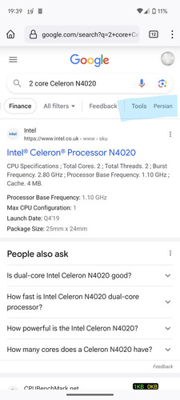
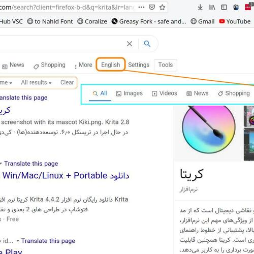

<h2 align="center">
GSearch Toggle
</h2>

The userscript, GSearch Persian, enables users to switch between searches in Persian or all pages. It provides the functionality to change the language of the search results displayed on Google.

__Note__: It without RTL Direction

### Summary
GSearch Toggle is a browser user script that executes scripts like Tampermonkey, Greasemonkey, and others. It allows users to switch between English and Persian search results without the right-to-left (RTL) direction effect. This can be done by adding a button beneath the Google search box.

### Features
- Add a Persian button on the Google result page.

  

## Screenshots

[Mobile](Screenshots/Mobile.jpg) 

[Desktop/Tablet](Screenshots/01.jpg) 

