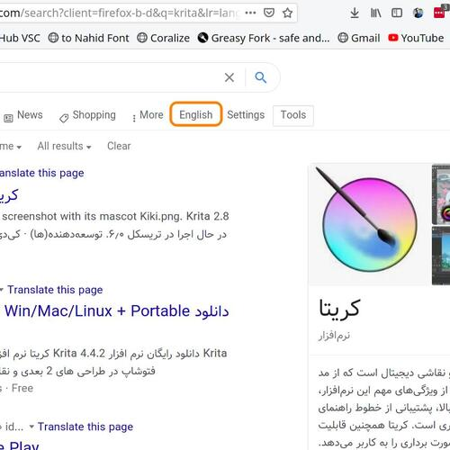

<h2 align="center">
GSearch Toggle Lang
</h2>

The userscript, GSearch Toggle Lang, enables users to switch between two different languages for Google search results. It provides the functionality to change the language of the search results displayed on Google.

__Note__: GToggle Search is  without RTL Direction

### Summary
GSearch Toggle is a user script for browsers that executes scripts like Tampermonkey, Greasemonkey, and others. It allows users to switch between English and Persian search results without the right-to-left (RTL) direction effect. This can be done by adding a button beneath the Google search box.

### Features
- Add a Persian/English button in google search page.

## Screenshots

    <a href="Screenshots/01.jpg">
        
          
        Screenshot 1 full size
    </a>

        

    <a href="Screenshots/02.jpg">
        
          
        Screenshot 2 full size
    </a>

        

    <a href="Screenshots/03.jpg">
        
            
        Screenshot 3 full size
    </a>

 

